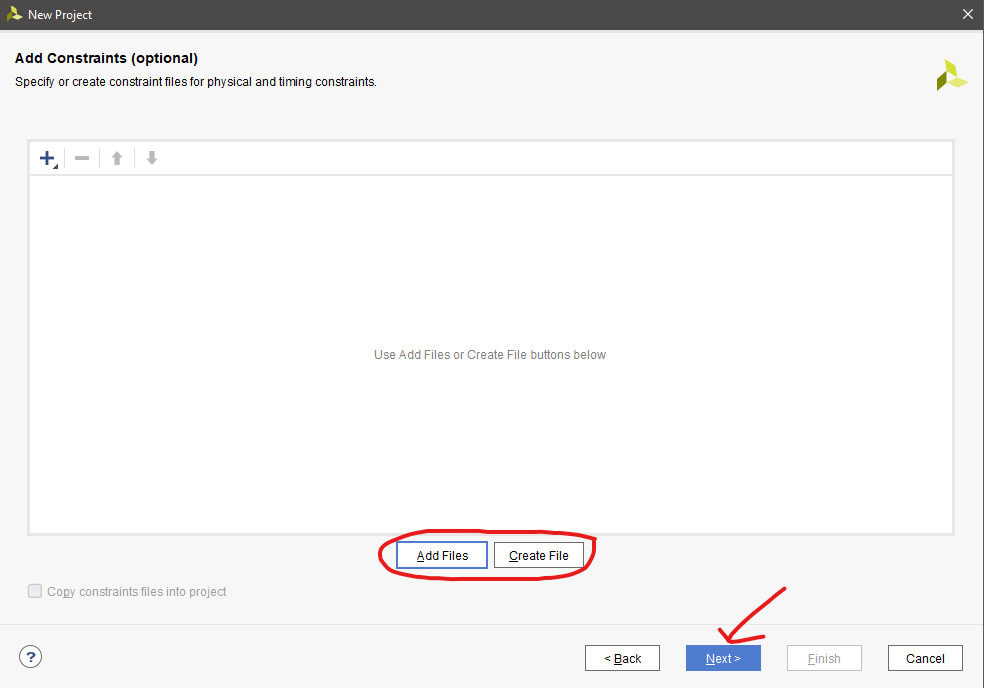

# 03-vivado

## Link to my GitHub

https://github.com/DivinityQQ/Digital-electronics-1

## Preparation tasks

### Table with connection of 16 slide switches and 16 LEDs on Nexys A7 board

| **LED** | **Connection** | **Switch** | **Connection** | 
| :-: | :-: | :-: | :-: |
| LED0 | H17 | SW0 | J15 |
| LED1 | K15 | SW1 | L16 |
| LED2 | J13 | SW2 | M13 |
| LED3 | N14 | SW3 | R15 |
| LED4 | R18 | SW4 | R17 |
| LED5 | V17 | SW5 | T18 |
| LED6 | U17 | SW6 | U18 |
| LED7 | U16 | SW7 | R13 |
| LED8 | V16 | SW8 | T8 |
| LED9 | T15 | SW9 | U8 |
| LED10 | U14 | SW10 | R16 |
| LED11 | T16 | SW11 | T13 |
| LED12 | V15 | SW12 | H6 |
| LED13 | V14 | SW13 | U12 |
| LED14 | V12 | SW14 | U11 |
| LED15 | V11 | SW15 | V10 |

## Two-bit wide 4-to-1 multiplexer

### Listing of VHDL architecture from source file

```vhdl
architecture Behavioral of mux_2bit_4to1 is
begin

    with sel_i select
        f_o <= a_i when "00",  -- If sel_i = "00" then f_o = a_i
               b_i when "01",
               c_i when "10",
               d_i when others; -- All other combinations


end architecture Behavioral;
```

### Listing of VHDL stimulus process from testbench file

```vhdl
p_stimulus : process
begin
    -- Report a note at the begining of stimulus process
    report "Stimulus process started" severity note;
    s_c   <= "00"; s_d <= "00"; s_b <= "00"; s_a <= "00";
    s_sel <= "00"; wait for 100 ns;
    
    s_a   <= "01"; wait for 100 ns;
    s_b   <= "01"; wait for 100 ns;
    
    s_sel <= "01"; wait for 100 ns;
    
    s_b   <= "11"; wait for 100 ns;
    s_d   <= "11"; wait for 100 ns;
    
    s_sel <= "11"; wait for 100 ns;
    
    s_d   <= "10"; wait for 100 ns;
    -- Report a note at the end of stimulus process
    report "Stimulus process finished" severity note;
    wait;
end process p_stimulus;
```

### Screenshot with simulated time waveforms


## A Vivado tutorial

1. Create project


2. Click next


3. Name your project


4. Select project tzpe as RTL Project


5. Add sources


6. Add or create constraint files (optional)


7. Select your board


8. Review the summary and click next


9. No need to change anything in define module popup, just click next


10. File -> Add Sources... or Alt+A


11. Select testbench, create file and name your file tb_yourtb


12. Run simulation
